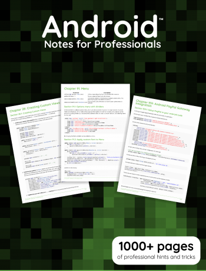

# 
eBooks

#### _Read this in [other languages](translations/Translations.md)._
<kbd></kbd>
---

Programming Language eBooks for Professionals

<kbd></kbd>
<kbd></kbd>
<kbd></kbd>
<kbd></kbd>
<kbd></kbd>
<kbd></kbd>
<kbd></kbd>

